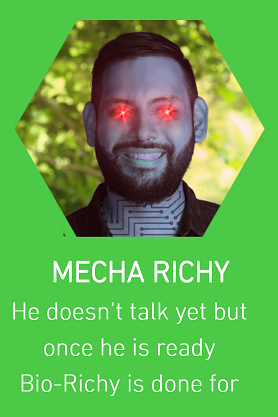

Mecha-Richy
===========

**Mecha-Richy is like Richy, but it's better.**

[Check out its burn address here!](https://nimiq.watch/#NQ05+MECH+AR0C+HY00+0000+0000+0000+0000+0000)

Features
--------
- [ ] New token (MECHA) by burning your NIM.
- [ ] Asset issuance.
- [ ] Transfer asset ownership.
- [ ] Lock asset.
- [ ] Name registration.
- [ ] Voting.
- [ ] Smart-contracts.
- [ ] zk-SNARK.
- [ ] Decentralized oracles (developed in collaboration with Jason Parser)
- [ ] Crex24 listing
- [ ] Deep Convolutional Neural Networks (DCNN)
- [ ] WiiU wallet

References
----------
- [NimiqCash](https://nimiqcash.wixsite.com/home)
- [Counterparty](https://counterparty.io/feature/)
- [Blockstack](https://blockstack.org/)
- [NIPOPOW](https://nipopows.com/)

